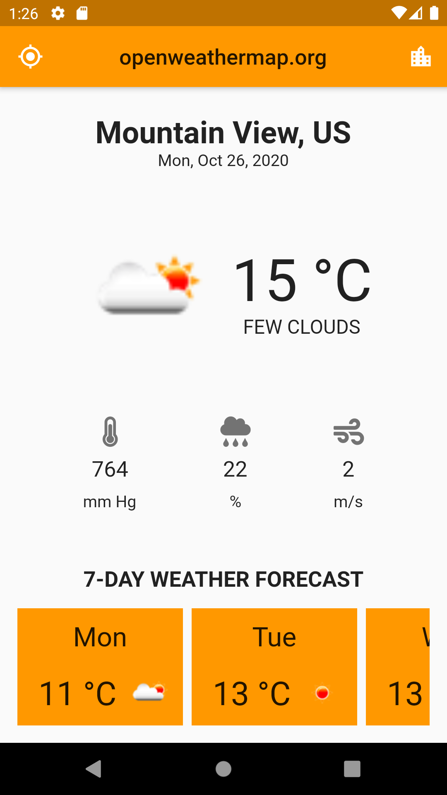
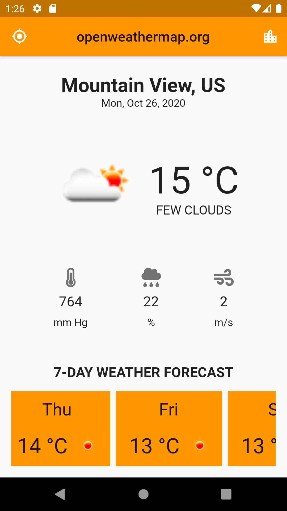
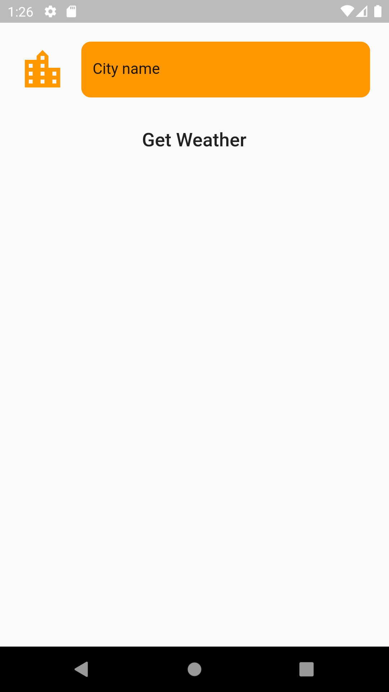
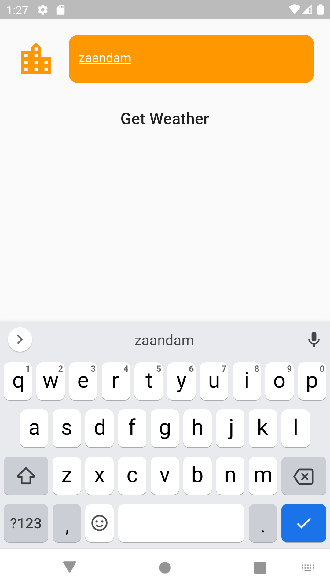
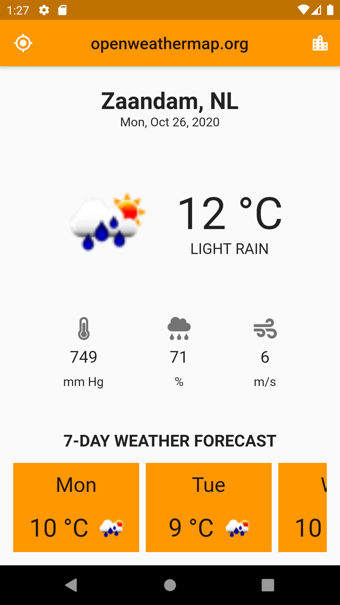

# Weather_app
 
This is a demo wetaher forecast app implemented with [Flutter](https://flutter.dev/). The app runs on iOS an Android.
It fetches weather data from openweathermap open API. 
As for target location the app is able fetch current device location or use location manually entered by a user.

# Screenshots
## Main screen

## Manually enter location

## Updated main screen
